# Engagement UI Guide — Flutter Implementation

> **Purpose:** UI/UX patterns and implementation guide for engagement features.
> 
> This guide follows Anthropic's progressive disclosure pattern: core concepts first, implementation details on-demand.

---

## Quick Reference

| Feature | Priority | Endpoint | Complexity |
|---------|----------|----------|------------|
| Streak Display | High | `GET /engagement/summary` | Low |
| Streak Widget | High | `GET /engagement/streak` | Medium |
| Activity Reminders | Medium | Local + streak data | Medium |
| Personal Best Celebration | Low | From streak update | Low |

---

## 1. Core Concepts

### 1.1 What is a Streak?

A streak counts **consecutive days** where the user logged at least one financial activity:
- Creating a manual transaction
- Committing an invoice (receipt scan)

**Key Fields:**
| Field | Type | Description |
|-------|------|-------------|
| `current_streak` | int | Current consecutive days |
| `longest_streak` | int | Personal best (all-time) |
| `streak_at_risk` | bool | True if no activity today |
| `has_logged_today` | bool | True if activity logged today |

### 1.2 Streak Freeze

Users get **one free "miss day" per week**:
- Automatically used if needed (no manual action)
- Resets every Monday (UTC)
- Shows "🧊 Freeze used" when consumed

**Freeze Fields:**
| Field | Type | Description |
|-------|------|-------------|
| `streak_freeze_available` | bool | Whether freeze protection exists |
| `streak_freeze_used_this_week` | bool | Whether freeze was used |

---

## 2. UI Components

### 2.1 Streak Badge (Minimal)

**When to use:** App bar, profile screen, anywhere space is limited.

```
┌────────────┐
│ 🔥 7       │
└────────────┘
```

**Implementation:**
- Just show `current_streak` with fire emoji
- Color: Orange/red gradient for active streaks

### 2.2 Streak Card (Standard)

**When to use:** Home screen, dashboard.

```
┌────────────────────────────────┐
│  🔥 7 day streak               │
│  Personal best: 14             │
│                                │
│  ✅ Logged today               │
└────────────────────────────────┘
```

**States:**
| State | Display |
|-------|---------|
| Logged today | Green checkmark ✅ |
| At risk (not logged) | Yellow warning ⚠️ |
| Streak frozen | Ice emoji 🧊 |

### 2.3 Streak Widget (Full)

**When to use:** Dedicated engagement section, streak details page.

```
┌────────────────────────────────┐
│       🔥🔥🔥🔥🔥🔥🔥            │
│                                │
│    Current: 7 days             │
│    Best: 14 days               │
│                                │
│  ┌─ Status ──────────────────┐ │
│  │ ✅ Logged today           │ │
│  │ 🧊 Freeze available       │ │
│  └───────────────────────────┘ │
│                                │
│    Keep it up! Log tomorrow    │
│    to continue your streak.    │
└────────────────────────────────┘
```

---

## 3. User Flows

### 3.1 App Launch Flow

```mermaid
sequenceDiagram
    participant App
    participant API
    participant UI
    
    App->>API: GET /engagement/summary
    API-->>App: { current_streak, streak_at_risk, has_logged_today }
    
    alt has_logged_today = true
        App->>UI: Show ✅ badge
    else streak_at_risk = true
        App->>UI: Show ⚠️ warning
        App->>UI: Show reminder card
    else no streak (current_streak = 0)
        App->>UI: Show "Start a streak!" CTA
    end
```



### 3.2 After Transaction Creation

```mermaid
sequenceDiagram
    participant User
    participant App
    participant API
    
    User->>App: Create transaction
    App->>API: POST /transactions
    API-->>App: 201 CREATED
    
    Note over API: Backend auto-updates streak
    
    App->>App: Refresh engagement data
    
    alt new_personal_best
        App->>User: 🎉 New personal best!
    else streak_continued
        App->>User: 🔥 Streak continues!
    else streak_frozen
        App->>User: 🧊 Freeze used!
    end
```



### 3.3 Reminder Notification Flow

```
Local notification trigger:
1. Check if streak_at_risk = true AND has_logged_today = false
2. Schedule notification for evening (e.g., 8 PM local)
3. Message: "Don't break your 7-day streak! Log an expense now."
4. Cancel if user logs activity before trigger time
```

---

## 4. API Integration

### 4.1 Fetch Streak Summary

**Use case:** Quick check for home screen badge.

```dart
class EngagementService {
  final SupabaseClient supabase;
  
  Future<EngagementSummary> getSummary() async {
    final response = await supabase
        .functions
        .invoke('engagement-summary');  // Or REST call
    
    return EngagementSummary.fromJson(response.data);
  }
}

class EngagementSummary {
  final int currentStreak;
  final int longestStreak;
  final bool streakAtRisk;
  final bool streakFreezeAvailable;
  final bool hasLoggedToday;
  
  // ... constructor, fromJson
}
```

### 4.2 Fetch Full Streak Status

**Use case:** Streak details page, widget with risk info.

```dart
Future<StreakStatus> getStreakStatus() async {
  final response = await http.get(
    Uri.parse('$baseUrl/engagement/streak'),
    headers: {'Authorization': 'Bearer $accessToken'},
  );
  
  return StreakStatus.fromJson(jsonDecode(response.body));
}

class StreakStatus {
  final int currentStreak;
  final int longestStreak;
  final DateTime? lastActivityDate;
  final bool streakFreezeAvailable;
  final bool streakAtRisk;
  final int? daysUntilStreakBreak;
  
  // ... constructor, fromJson
}
```

### 4.3 Handle Streak Update After Transaction

**Note:** The backend automatically updates streak. You just need to refresh UI.

```dart
Future<void> createTransaction(TransactionData data) async {
  // Create transaction
  final response = await http.post(
    Uri.parse('$baseUrl/transactions'),
    headers: {'Authorization': 'Bearer $accessToken'},
    body: jsonEncode(data.toJson()),
  );
  
  if (response.statusCode == 201) {
    // Refresh engagement data to update UI
    await engagementService.getSummary();
    
    // Optionally show celebration if appropriate
    // (could also be returned in transaction response)
  }
}
```

---

## 5. State Management

### 5.1 Recommended Provider Pattern

```dart
class EngagementProvider extends ChangeNotifier {
  EngagementSummary? _summary;
  bool _loading = false;
  
  EngagementSummary? get summary => _summary;
  bool get loading => _loading;
  
  // Computed getters for UI
  int get currentStreak => _summary?.currentStreak ?? 0;
  bool get hasLoggedToday => _summary?.hasLoggedToday ?? false;
  bool get isAtRisk => (_summary?.streakAtRisk ?? false) && !hasLoggedToday;
  
  Future<void> refresh() async {
    _loading = true;
    notifyListeners();
    
    try {
      _summary = await EngagementService().getSummary();
    } finally {
      _loading = false;
      notifyListeners();
    }
  }
  
  void onActivityLogged() {
    // Optimistic update
    if (_summary != null) {
      _summary = _summary!.copyWith(
        hasLoggedToday: true,
        streakAtRisk: false,
        currentStreak: _summary!.currentStreak + (hasLoggedToday ? 0 : 1),
      );
      notifyListeners();
    }
    
    // Then refresh from server
    refresh();
  }
}
```

### 5.2 When to Refresh

| Event | Action |
|-------|--------|
| App launch | `refresh()` |
| Transaction created | `onActivityLogged()` |
| Invoice committed | `onActivityLogged()` |
| Return from background (>1h) | `refresh()` |
| Pull-to-refresh on home | `refresh()` |

---

## 6. Visual Design Guidelines

### 6.1 Colors

| State | Color | Hex |
|-------|-------|-----|
| Active streak | Orange/Red gradient | `#FF6B35` → `#E63946` |
| Logged today | Success green | `#4CAF50` |
| At risk | Warning yellow | `#FFC107` |
| Frozen | Ice blue | `#64B5F6` |
| No streak | Neutral gray | `#9E9E9E` |

### 6.2 Animation Ideas

| Trigger | Animation |
|---------|-----------|
| Streak increment | Fire emoji pulse + number tick-up |
| New personal best | Confetti burst 🎉 |
| Freeze used | Snowflake fall animation ❄️ |
| Streak at risk | Gentle pulse on warning icon |

### 6.3 Haptics

| Action | Haptic |
|--------|--------|
| Streak continued | Light success tap |
| New personal best | Medium celebration vibration |
| Reminder tap | Light tap |

---

## 7. Accessibility

### 7.1 Screen Reader Labels

```dart
Semantics(
  label: 'Your current streak is 7 days. '
         'Personal best is 14 days. '
         'You have logged activity today.',
  child: StreakCard(...),
)
```

### 7.2 Color Contrast

Ensure all text meets WCAG AA:
- Orange text on white: Use #D84315 (darker orange)
- Green text on white: Use #388E3C (darker green)

### 7.3 Motion Preferences

```dart
final reduceMotion = MediaQuery.of(context).disableAnimations;

if (!reduceMotion) {
  // Show fire animation
} else {
  // Show static fire emoji
}
```

---

## 8. Testing Checklist

### 8.1 Manual Testing

- [ ] First-time user sees "Start a streak" CTA
- [ ] Creating transaction shows streak increment
- [ ] Streak at risk shows warning when not logged today
- [ ] Freeze used shows ice indicator
- [ ] New personal best triggers celebration
- [ ] Pull-to-refresh updates streak data
- [ ] App resume refreshes streak

### 8.2 Edge Cases

- [ ] User with 0 streak
- [ ] User with very long streak (100+ days)
- [ ] User who just used freeze
- [ ] Multiple transactions same day (idempotent)
- [ ] Network error during refresh
- [ ] Timezone considerations (UTC vs local)

---

## 9. Future Enhancements (Phase 2)

These features are documented but not yet implemented:

### 9.1 Streak Milestones
- 7-day badge
- 30-day badge
- 100-day badge
- Custom celebrations per milestone

### 9.2 Social Features
- Share streak achievement
- Leaderboard (opt-in)
- Friend challenges

### 9.3 Streak Recovery
- Purchase streak protection
- "Weekend mode" (no penalty for Sat/Sun)
- Grace period settings

---

## 10. Related Documentation

- **API Reference:** [docs/api/engagement.md](../../docs/api/engagement.md)
- **Database Schema:** [docs/db/tables.md](../../docs/db/tables.md#profile)
- **RPC Functions:** [RPC-documentation.md](../../RPC-documentation.md#engagement-rpcs)
- **Engagement Strategy:** [DECISIONS/2025-12-01-engagement-strategy.md](../../DECISIONS/2025-12-01-engagement-strategy.md)
